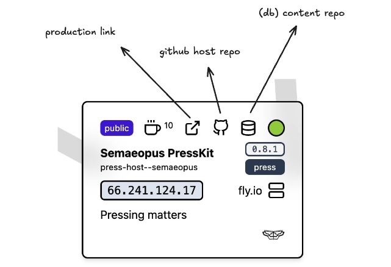
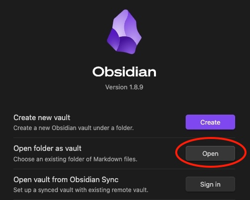
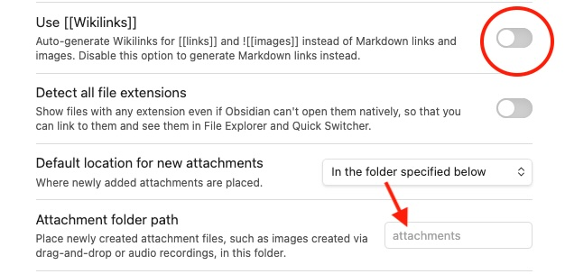

# Onboarding

_Please deprecate this process once setup!_

> We are aligning so we can keep track of the cards in codecks, and acknowledge **who is accountable** to which site and its **priority**

**Dashboard**
https://microsites-dashboard.fly.dev/



### Github repo naming convention

Finding a repo can be hard when there's so many. We use this BEM naming convention so we can navigate URLs easily.

`[organisation]/[site-type]-[repo-type]--[project]`

- site-type: `wiki | press | site`
- repo-type: `host | content`
- project: `offgrid | etc`

> _For this **content** context, you will probably only need to use content type_

`semaeopus/wiki-content--offgrid`

### Content

Offgrid Wiki - can we use https://codebeautify.org/html-to-markdown

Make changes to the content repo, and the site rebuilds.

### Issues & Feature requests

Report them to the Discord `#wiki-making` channel.

---

## Onboarding Checklist

- Github Account
- Get added to Semaeopus Team on Github
- Use [Desktop](https://desktop.github.com/download/) app for sync
- Use [Obsidan](https://obsidian.md/) for markdown content
- Pull a `content` site (using GH app)
- Connect repo to Obsidian vault

Strategy for Obsidian



You will want to open the vault at the **root** of the repo.
This will contain the following:

```
readme.md
static/
content/
	attachments/
	Your Content.md
```

plus some hidden files

_The plan was_ to open the vault at `content` itself, but Obsidian renames the `content` directory as the respective `vault` name, which then screws publication.

> There is a way around this whereby we name the content as the preferred vault name and pass this to the _build step_ as a **Github variable**.

### images

You can drag in from your machine ... but we need to sync them too!
So we set up the Obsidian vault to use the `attachments` directory.

We also **disable** wikilinks, so file paths are maintained.



### Frontmatter

Current available fields:

```
---
description: SEO powers for wiki specific page
published: true # also defaults to true (sets visibility)
pin: 1111 # will lock page privately behind a hash
tags: ['blog']
---
```

---

## Welcome to Community content

This would be a community facing **public** repo.
Rules and regs in order to submit PRs
